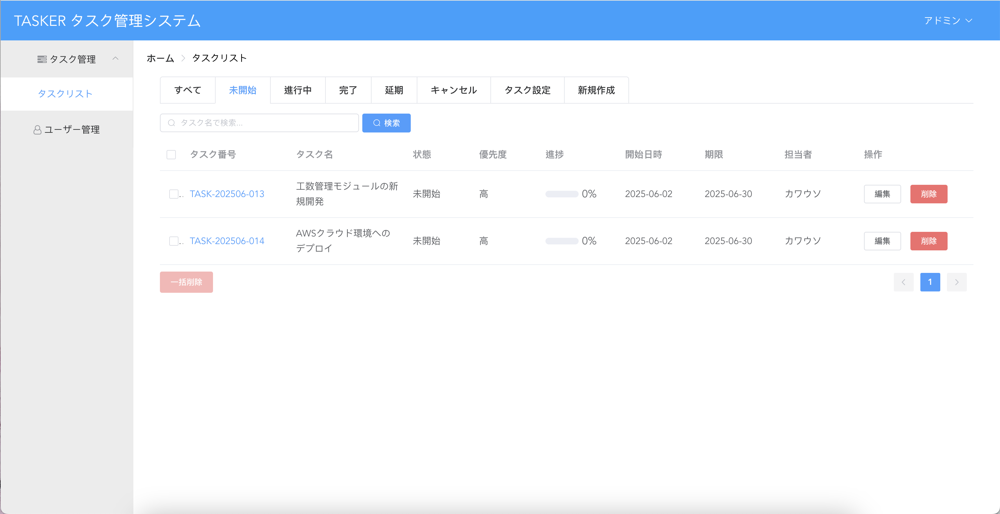

# タスク管理システム「Tasker」

## 概要

本プロジェクトは、Spring Boot（バックエンド）＋ Vue2（フロントエンド）で構築したタスク管理システムです。
タスクの作成・編集・削除、進捗管理、担当者割り当て、権限管理などの基本機能を実装しています。
[オリジナルのVBlog](https://github.com/lenve/VBlog) をベースに、 
タスク管理システム向けに再構築し、業務フローや権限制御を設計・実装したうえで、日本語UI化も行った個人開発プロジェクトです。

---

## 目次

* [デモ画面](#デモ画面)
* [主な機能](#主な機能)
* [技術スタック](#技術スタック)
* [ディレクトリ構成](#ディレクトリ構成)
* [セットアップ方法](#セットアップ方法)
* [初期データの導入方法](#初期データの導入方法)
* [ユーザーアカウント情報](#ユーザーアカウント情報)
* [注意事項・補足](#注意事項・補足)
* [ライセンス](#ライセンス)
* [English Summary](#english-summary)

---

## デモ画面

### ログインページ


### 1. タスク一覧（管理者・ユーザー）

- 管理者画面  
  

- 一般ユーザー画面（進捗更新画面）  
  

### 2. タスク新規作成


### 3. ユーザー管理（管理者専用）


---

## 主な機能

* タスクの一覧表示／検索／絞り込み（状態・優先度）
* タスク新規作成／編集／削除／進捗更新
* タスク担当者（ユーザー）の割り当て
* ステータス・優先度管理
* ログイン認証・ユーザー権限（管理者／一般ユーザー）
* ページネーション（ページ送り機能）
* 日本語UI（画面・エラーメッセージ・通知等）

---

## 今後の機能予定 

* カテゴリ管理（DB構造のみ事前に準備済み、今後UI/バックエンド拡張予定）
* AWSクラウド環境へのデプロイ（EC2, RDSなど本番環境運用対応）
* 工数管理モジュール（作業ログ/タイムトラッキング）
* 承認者（アプローバル）ロールの追加（高度なロールベース権限管理）

---

## 技術スタック

* **バックエンド**: Spring Boot, MyBatis, MySQL, Spring Security
* **フロントエンド**: Vue2, Element UI
* **API設計**: RESTful（JSON形式/一部フォーム形式）
* **その他**: Maven, Druid, Lombok, Log4j

---

## ディレクトリ構成

```plaintext
Tasker/
├── tasker-server/
│   ├── src/
│   │   ├── main/java/org/esther/...
│   │   └── main/resources/
│   │       ├── application.properties
│   │       └── static/index.html
│   ├── pom.xml
│   └── ...（その他省略）
├── tasker-front/
│   ├── src/
│   └── package.json
├── sql/
│   └── tasker.sql
├── README.md
```

---

## セットアップ方法

### 1. 必要ソフトウェア

* JDK 1.8 以上
* Maven 3.6 以上
* Node.js, npm（フロントエンド開発時）
* MySQL 5.7/8.0

### 2. バックエンドの起動

1. `application.properties`内のDB接続設定を自身の環境に合わせて修正
2. 初期DB（`/sql/tasker.sql`）をMySQLへインポート
3. プロジェクトルートで以下コマンドを実行

   ```bash
   mvn clean package
   java -jar target/tasker-server-0.0.1-SNAPSHOT.jar
   ```

### 3. フロントエンドの起動（開発用）

1. `/tasker-front` ディレクトリで

   ```bash
   npm install
   npm run dev  # または npm run serve（package.jsonを確認）
   ```
2. プロダクション用ビルドは npm run build 実行後、生成されたファイルを /static ディレクトリに配置してください

---

## アクセスURL

> - 開発モード（npm run dev）: [http://localhost:8080](http://localhost:8080)
> - バックエンドにビルド済みファイル配置後: [http://localhost:8081/index.html](http://localhost:8081/index.html)
> - デモページ（静的フロントエンド）: https://estherau.github.io/tasker-pages/
* デモページはフロントエンドのみの静的展示です。全機能（ログインやタスク操作など）をご利用いただくには、ローカルでバックエンドを起動してください。

---

## ユーザーアカウント情報（デモ用）

| ロール  | ユーザー名 | パスワード |
| ---- |-------| --- |
| 管理者  | admin | 123 |
| ユーザー | otter | 123 |

> ※ パスワードやアカウントはご自身で追加・変更できます

---

## 注意事項・補足

* 本プロジェクトは個人の学習に作成されたものであり、商用利用や本番運用にはセキュリティ追加対策が必要です。
* 工数管理、通知、カテゴリ機能、細かな権限分割などは今後追加・拡張予定です。
* ご質問・バグ報告等は [Issues](https://github.com/EstherAu/Tasker/issues) からお気軽にどうぞ。

---

## ライセンス

MIT License

---

## English Summary

*This project is based on [VBlog](https://github.com/lenve/VBlog), and was restructured/localized to fit general task management use cases.*

**Tasker** is a task management system built with Spring Boot (backend) and Vue2 (frontend).
Key features include task CRUD, status/priority/user assignment, admin/user roles, and pagination.
Please refer to the Japanese README above for setup and usage. For inquiries in English, feel free to open an issue.


